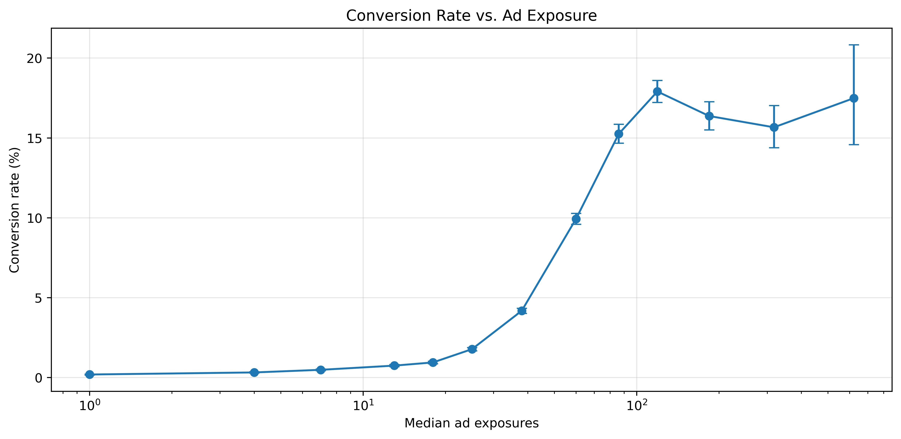

# Marketing A/B Testing

An A/B testing project that evaluates whether an advertising treatment increases conversion relative to a PSA control. The project covers conversion rate comparison, bootstrap confidence intervals, permutation testing, and descriptive analysis of conversion across different levels of ad exposure.

## Results Preview

The advertising treatment produced a higher conversion rate than the PSA control, with a positive treatment effect and a statistically significant difference.

<p align="center">
  
</p>

The exposure analysis shows how conversion varies across different levels of ad exposure. This relationship is treated as descriptive rather than causal because ad exposure was not randomized.

## Installation

This project was developed using Python.

### Clone the repository

```bash
git clone https://github.com/xxtofff/Marketing-AB-Testing
cd Marketing-AB-Testing
````

### Create a virtual environment

**Windows**

```bash
python -m venv .venv
.venv\Scripts\activate
```

**Linux/macOS**

```bash
python3 -m venv .venv
source .venv/bin/activate
```

### Install dependencies

```bash
pip install -r requirements.txt
```

## Quick Start

Run the notebook:

```text
notebooks/ab_testing.ipynb
```

The notebook reads the raw marketing dataset from `data/raw/` and saves generated figures to `outputs/figures/`.

## Workflow

1. **Data Preparation**

   * Load the marketing dataset.
   * Remove the user ID column.
   * Inspect the dataset and conversion counts by test group.

2. **A/B Testing**

   * Compare conversion rates between the Ad and PSA groups.
   * Estimate the treatment effect using a bootstrap confidence interval.
   * Use a permutation test to evaluate the difference under the null hypothesis.

3. **Ad Exposure Analysis**

   * Compare ad exposure between converted and non-converted users.
   * Group users by total ad exposures.
   * Calculate conversion rates and Wilson confidence intervals for each exposure group.
   * Visualize conversion rate against ad exposure.

4. **Business Recommendation**

   * Interpret the estimated treatment effect.
   * Discuss the limitations of the exposure analysis.
   * Consider the need for a separate profitability analysis and exposure experiment.

## Statistical Methods

The treatment effect is measured as the difference in conversion rates between the Ad and PSA groups.

A bootstrap procedure is used to estimate a 95% confidence interval for this difference. A permutation test is then used to test:

$$
H_0: R_{\mathrm{Ad}} = R_{\mathrm{PSA}}
$$

against:

$$
H_1: R_{\mathrm{Ad}} > R_{\mathrm{PSA}}
$$

The analysis uses 10,000 bootstrap and permutation iterations.

## Project Structure

```text
.
├── data
│   └── raw
│       └── marketing_AB.csv
├── notebooks
│   └── ab_testing.ipynb
├── outputs
│   └── figures
│       ├── conv_ad.jpg
│       ├── conv_ad.png
│       └── hist.jpg
├── README.md
└── requirements.txt
```

## Results

The Ad group had a higher conversion rate than the PSA group. The estimated treatment effect was positive, with the confidence interval excluding zero and the permutation test indicating a statistically significant difference.

The exposure analysis shows a strong association between ad exposure and conversion, but this relationship should not be interpreted as causal. Users with higher engagement may both receive more ads and be more likely to convert, and conversion itself may affect subsequent ad exposure.

The dataset also does not contain advertising costs, revenue, or profit, so the financial efficiency of the campaign cannot be determined from this analysis alone.

## Data Source

* Marketing A/B Testing Dataset (Kaggle): https://www.kaggle.com/datasets/faviovaz/marketing-ab-testing

## License

The source code in this repository is licensed under the MIT License.
The dataset remains subject to its original license and terms; see the Data Source section.